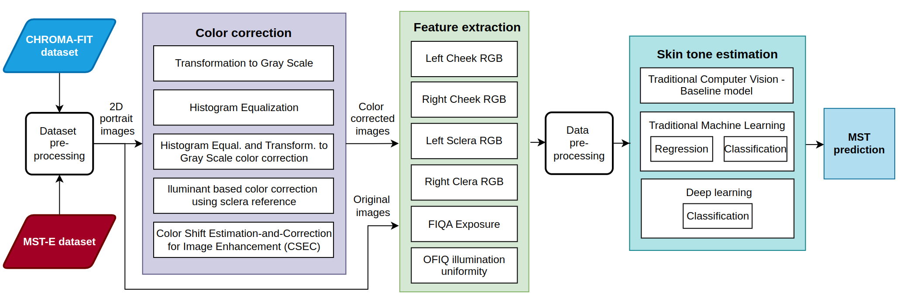
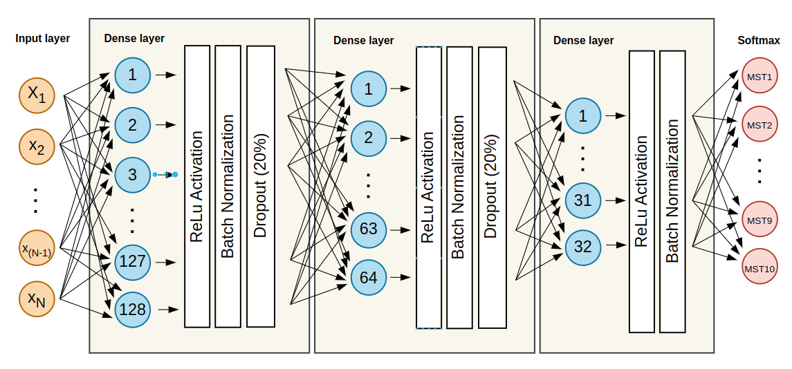

# Towards Skin Tone Inclusive Biometrics. Accurate and Inclusive Skin Tone Estimation from 2D Face Images

## Overview

The aim of this project is to investigate classic computer vision, traditional machine, and deep learning techniques to develop a skin tone estimation method for 2D face images which will be achieved with the main research question: **To what extent is it possible to use machine learning methods to develop an accurate skin tone estimation model to determine the MST category given 2D portrait images?**

The methodology of the project, as visualized below, is based on the CHROMA-FIT and MST-E datasets, and the associated pre-processing steps together with color correction models aimed to recover the actual skin tone by adjusting various distortions. The project extracts 14 features from facial images which can be classified into 6 categories: (i) left cheek RGB, (ii) right cheek RGB, (iii) left sclera RGB, (iv) right sclera RGB, (v) FIQA underexposure value, (vi) OFIQ illumination uniformity. The extracted features are used in classic computer vision, traditional and deep learning based approaches, to estimate the skin tone of an individual and categorize it into the 10 Monk Skin Tone scale categories.

## Abstract

Biometric systems aiming to identify and validate individuals have been used in a variety of fields, such as healthcare, security, and monitoring systems. As the reliance on these systems continues to increase, there is a need to investigate whether face recognition and other biometric technologies are not only accurate but also fair and consistent across diverse groups of individuals. Research has investigated the classification of data subjects based on ethnicity or country of origin. However, due to attribute fluidity and subjectivity, other types of more observable characteristics should be considered. The skin tone of an individual refers to the color appearance of a individual's skin, which is highly variable between data subjects, but through the use of skin tone scales, it provides a systematic way of objectively categorizing diverse individuals. With numerous different scales investigated in the last decades, a newly released Monk Skin Tone (MST) scale in collaboration with Google {Monk_2019} addresses the limitations of other scales by including a broader range of shades, but still focusing on ease of annotation, classification, and fairness. Therefore, the aim of this project is to investigate and develop a skin tone estimation model for 2D face images through various computer vision, machine, and deep learning techniques, to be used for future bias estimation in datasets and biometric systems. The project focuses on skin tone estimation using extracted features, carefully chosen through domain investigation together with various image correction models. It also analyzes the applicability of the sclera, the white part of the eye, which has the same baseline color and is nearly consistent for all healthy individuals no matter the skin tone, gender, or ethnicity. The results show that the deep learning model has the best classification compared to classic computer vision and traditional machine learning models when tested on the CHORMA-FIT dataset {pangelinan2024chroma}. However, it struggles to generalize when trained on CHROMA-FIT and tested on a significantly different, unseen MST-E dataset {schumann2024consensus}. Thus, it uncovered the need for further research on dataset acquisition to increase the number of images, which would help to support model generalization.

## Setup

### 1. Clone the repository

`git clone https://github.com/indrikutis/skin_tone_estimation.git`

### 2. Requirements

The project uses 3.10 Python version and was build using the Linux operating system. To install all necessary dependencies, the [Conda](https://docs.conda.io/projects/conda/en/latest/index.html) environment can be created and activated by running the following commands in the terminal:

1. `conda create --name skinToneEstimation`
2. `conda activate skinToneEstimation`
3. `pip install -r requirements.txt`

### 3. Download necceccary files

1. Dlib library 68 Face Landmarks Predictor: [68 Face Landmarks Predictor](https://github.com/italojs/facial-landmarks-recognition/blob/master/shape_predictor_68_face_landmarks.dat)
2. Robust Sclera Segmentation for Skin-Tone Agnostic Face Image Quality Assessment: [Sclera segmentation](https://github.com/wkabbani/sclera-segmentation)
3. Open Source Face Image Quality (OFIQ) framework, Python wrapper: [OFIQ framework](https://github.com/torss/OFIQ-Project)
4. FIQA Underexposure Bias framework: [FIQA](https://github.com/dasec/FIQA-Underexposure-Bias)

## Usage

The repository contains several subfolders for different sections of the project, each containing a Jupyter notebook with main functionalities. Some of the folders have `results` files containing the output from Jupyter files. Each of the folders have a respective library file in the `utils` folder. 

### Color correction

This section includes methods to color correct the images and remove the environmental factors, aiming to recover a true skin tone. 

#### Color Shift Estimation-and-Correction for Image Enhancement (CSEC)

Color correction by using the CSEC model is based on the [CSEC GitHub](https://github.com/yiyulics/CSEC) repository. 

#### Sclera-Based Illuminant Color Correction

To color correct the images by using the sclera reference, sclera is first segmented from portrait images, and the mean sclera RGB color is saved to the JSON output file. The notebook contains experiments on sclera segmentation which utilizes the landmark based model and Otsu thresholding for further improvements. This is acheived in the following notebook: [Sclera segmentation](sclera_segmentation/sclera_segmentation.ipynb).

The extracted sclera color is compared to the reference sclera to estimate the color and illumination changes, used to color correct the image. This is acheived in the following notebook: [Sclera based color correction](color_correction/sclera_based_color_correction.ipynb)

### Baseline model

This section contains baseline models used for benchmarking other methods. It is based on face cheek patches color extraction from 2D portrait images. This is acheived in the following notebook:[Baseline model jupyter notebook](baseline/OFIQ_baseline.ipynb). The notebook also contains:

1. Generations of image lists
2. Dataset pre-processing steps
3. CHROMA-FIT dataset splitting into indoor and outdoor subsets, ground truth label conversion from RGB and CIE Lab* color spaces to MST categories
4. Dataset distribution investigations
5. Cheek patches extraction and mean color calculation
6. Baseline model accuracy calculation

### Traditional machine learning, multiclass classification and regression models

This section includes traditional machine learning models for classification and regression skin tone estimation. The models take the 14 extracted facial features as the input and predict MST categories, or a continuous RGB output.  

Some dataset pre-preprocessing steps are included in the [Data preprocessing notebook](multiclass_classification/data_preprocessing.ipynb), which mostly focuses on FIQA underexposure and OFIQ illumination uniformity feature extraction and provides the code to combine it with the rest of the project's features.

Multiclass classification and regression based skin tone estimation is acheived in the following notebook: [Multiclass classification and regression jupyter notebook](multiclass_classification/multiclass_classification_regression.ipynb). the notebook also contains:

1. Data preprocessing for machine learning models
2. Classification on Logistic Regression, Random Forest Classifier, SVM, MLPClassifier
3. Regression on XGBoost, Multi-Layer Perceptron Regressor, Support Vector Regression, LightGBM
4. Data pre-processing including outliers removal and SMOTE data augmentation
5. Principal component analysis on original and augmented data
6. ROC curve analysis

### Deep Learning model

A deep learning model is utilized for skin tone estimation. The model architecture is descried in the folowing diagram:

The skin tone estimation based on a deep learning model is in the [Deep Learning jupyter notebook](deep_learning/deep_learning.ipynb), containing various data pre-processing experiments to be investigated through the [Deep learning utils](utils/deep_learning_utils.py). 

## Disclaimer

The project is dependent on a lot of generated, and then locally saved files, and notebooks contain various experiments, data tests investigated during the duration of the thesis that are not fully integrated into the continuous notebook execution. Therefore, executing the entire notebook may result in errors or incomplete outputs. It is advised to run individual cells, and check carefully the input, output files in order to compile the code.

The datasets used in the project are CHROMA-FIT and MST-E. CHROMA-FIT dataset requires a license agreements for usage. 

## References

@INPROCEEDINGS{kabbani2023scleraseg,
  author={Kabbani, Wassim and Busch, Christoph and Raja, Kiran},
  booktitle={2023 International Conference of the Biometrics Special Interest Group (BIOSIG)}, 
  title={Robust Sclera Segmentation for Skin-Tone Agnostic Face Image Quality Assessment}, 
  year={2023},
  pages={1-6},
  doi={10.1109/BIOSIG58226.2023.10345985}
}

@misc{merkle2022stateartqualityassessment,
 author = {J. Merkle and C. Rathgeb and B. Herdeanu and B. Tams and D. Lou and A. D\"orsch and M. Schaubert and J. Dehen and L. Chen and X. Yin and D. Huang and A. Stratmann and M. Ginzler and M. Grimmer and C. Busch},
 howpublished = {\url{https://www.bsi.bund.de/SharedDocs/Downloads/EN/BSI/OFIQ/Projektabschlussbericht_OFIQ_1_0.pdf}},
 keywords = {2D Face Recognition, Sample Quality},
 month = {9},
 title = {Open Source Face Image Quality (OFIQ) - Implementation and Evaluation of Algorithms},
 year = {2024}
}

@misc{dlib,
  author       = {Davis E. King},
  title        = {DLib C++ Library},
  howpublished = {\url{http://dlib.net/}},
  note         = {Accessed: 2024-11-21}
}

@article{boutrosdetection,
  title={Detection and Mitigation of Bias in Under Exposure Estimation for Face Image Quality Assessment},
  author={D{\"o}rsch, A and Rathgeb, C and Grimmer, M and Busch, C},
  year={2024}
  %author={Boutros, F and Damer, N and Fang, M and Gomez-Barrero, M and Raja, K}
}

@article{schumann2024consensus,
  title={Consensus and subjectivity of skin tone annotation for ml fairness},
  author={Schumann, Candice and Olanubi, Femi and Wright, Auriel and Monk, Ellis and Heldreth, Courtney and Ricco, Susanna},
  journal={Advances in Neural Information Processing Systems},
  volume={36},
  year={2024}
}

@misc{Monk_2019, 
    title={Monk Skin Tone Scale}, url={https://skintone.google}, 
    author={Monk, Ellis}, 
    year={2019} 
}

@inproceedings{pangelinan2024chroma,
  title={The CHROMA-FIT Dataset: Characterizing Human Ranges of Melanin For Increased Tone-awareness},
  author={Pangelinan, Gabriella and Merino, Xavier and Langborgh, Samuel and Vangara, Kushal and Annan, Joyce and Beaubrun, Audison and Weekes, Troy and King, Michael C},
  booktitle={Proceedings of the IEEE/CVF Winter Conference on Applications of Computer Vision},
  pages={1170--1178},
  year={2024}
}

@inproceedings{wang2022local,
  title={Local color distributions prior for image enhancement},
  author={Wang, Haoyuan and Xu, Ke and Lau, Rynson WH},
  booktitle={European Conference on Computer Vision},
  pages={343--359},
  year={2022},
  organization={Springer}
}